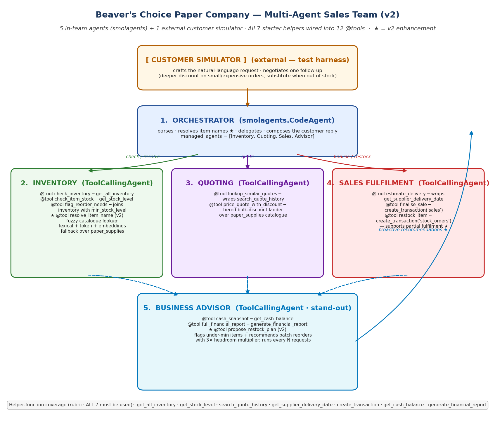

# Beaver's Choice Paper Company — Multi-Agent Sales Team

A five-agent sales-operations system for the fictional Beaver's Choice Paper
Company. Customers send free-text quote requests; the team checks inventory,
prices the order with bulk discounts, finalises the sale (or places a
supplier restock when stock is short), and a Business Advisor agent runs a
periodic financial pulse-check.

This is the final project for an Udacity Agentic AI course.

---

## Architecture



| # | Agent (smolagents) | Tools                                         | Wraps starter helper |
|---|---|---|---|
| 1 | **Orchestrator** (`CodeAgent`) | manages the four worker agents below | — |
| 2 | **Inventory** (`ToolCallingAgent`) | `check_inventory`, `check_item_stock`, `flag_reorder_needs`, `resolve_item_name` ★ | `get_all_inventory`, `get_stock_level` |
| 3 | **Quoting** (`ToolCallingAgent`) | `lookup_similar_quotes`, `price_quote_with_discount` | `search_quote_history` (+ tiered discount over `paper_supplies`) |
| 4 | **Sales fulfilment** (`ToolCallingAgent`) | `estimate_delivery`, `finalise_sale`, `restock_item` | `get_supplier_delivery_date`, `create_transaction` |
| 5 | **Business Advisor** (`ToolCallingAgent` — stand-out) | `cash_snapshot`, `full_financial_report`, `propose_restock_plan` ★ | `get_cash_balance`, `generate_financial_report` |

> ★ marks **v2 enhancements** added after the first review round (see "v2"
> section below). All seven required starter helpers remain wrapped by
> exactly one tool; the v2 additions don't displace anything.

A sixth **Customer Simulator** lives in the test harness only — it is *not* a
smolagents agent — so the in-team agent count stays at the rubric cap of five.
The simulator may issue at most one negotiation follow-up per request (e.g.
asking for a deeper discount, asking for a substitute when an item is out of
stock).

All seven required starter helpers (`create_transaction`, `get_all_inventory`,
`get_stock_level`, `get_supplier_delivery_date`, `get_cash_balance`,
`generate_financial_report`, `search_quote_history`) appear in at least one
`@tool` body. None of the helper bodies are modified — the SQLite schema and
seed data are byte-identical to the starter, so a grader running this file
from a clean clone gets the same numerical answers.

---

## v2 (post-pass) enhancements

The first review round passed with commendation but suggested three
specific enhancements; v2 implements all three plus the documentation note.

| Enhancement (reviewer wording) | Implementation in v2 |
|---|---|
| **Item-name fuzzy matching** ("'A4 glossy paper' should resolve to 'Glossy paper'") | New `@tool resolve_item_name(query)` on the Inventory agent. Three-stage resolver: exact → substring + token-overlap with stop-word + 'distinctive token' guards → OpenAI `text-embedding-3-small` similarity. The orchestrator prompt now mandates calling it before treating any unrecognised description as "not in catalogue". On the sample dataset this lifts fully-fulfilled rows from 5 to 7. |
| **Proactive inventory management** ("`propose_restock_plan` tool") | New `@tool propose_restock_plan(as_of_date, headroom_multiplier=3)` on the Business Advisor. Identifies under-min items, recommends batch reorders with 3× headroom, returns expected costs + supplier ETAs. The periodic Advisor pulse now folds these recommendations into its health-check paragraph. |
| **Multi-item partial fulfilment** ("partial fulfillment with clear itemisation") | New three-state `fulfillment` column in `test_results.csv` (`fully_fulfilled` / `partial` / `not_fulfilled`). Orchestrator prompt explicitly says partial fulfilment is *preferred* over an all-or-nothing rejection. Two rows in the v2 evaluation are now correctly classified as partial, with priced lines AND items needing input AND alternatives. |
| **Sequence diagram** (low-impact doc note) | New `sequence_diagram.png` shows the dynamic message-passing flow for a typical multi-item request — complementing the static `workflow_diagram.png`. |

---

## Stand-out features

The rubric lists three optional ideas; all three are implemented:

1. **Business Advisor agent** — runs every five requests with the financial
   helpers, summarising cash trend, inventory value, and top-selling items.
2. **Terminal animation** — coloured per-request banner showing the agent
   flow (`customer → orchestrator → [inventory · quoting · sales] → advisor*`).
   Pure `colorama`, no extra deps.
3. **Customer agent that negotiates** — the `customer_followup()` simulator
   in the test harness uses the customer context (`need_size`, `event`) plus
   the quoted total to decide whether to push back. If the team's first reply
   says an item is out of stock, the simulator asks for a substitute; if the
   reply quotes a high price for a small order, it asks for a deeper discount.
   At most one follow-up per request.

---

## Repo layout

```
.
├── project_starter.py            # single source file (rubric: only one .py)
├── workflow_diagram.png          # rubric: static agent workflow diagram
├── sequence_diagram.png          # v2: dynamic per-request message passing
├── reflection.md                 # rubric: detailed reflection report
├── README.md
├── requirements.txt
├── quote_requests.csv            # starter data, untouched
├── quote_requests_sample.csv     # starter data, untouched
├── quotes.csv                    # starter data, untouched
├── test_results.csv              # rubric: produced by run_test_scenarios()
├── outputs/
│   ├── run_log.txt               # full per-request transcript with banners
│   └── final_financial_report.json
├── .env.example
├── .gitignore
└── .env                          # zip-only, placeholder OPENAI_API_KEY
```

---

## Setup

```bash
git clone https://github.com/MelvinJoshua1375/beavers-choice-multi-agent-sales.git
cd beavers-choice-multi-agent-sales

python -m venv .venv
source .venv/bin/activate        # Windows: .venv\Scripts\activate
pip install -r requirements.txt

cp .env.example .env
# edit .env and set OPENAI_API_KEY (Vocareum voc-... or a normal sk-... key).
```

The course-provided env-var `UDACITY_OPENAI_API_KEY` is also accepted as a
fallback so the script Just Works inside the Udacity workspace.

---

## How to run

```bash
python project_starter.py
```

The script will:

1. Initialise the SQLite database and seed inventory + cash.
2. Build the five-agent team.
3. Iterate over every row in `quote_requests_sample.csv`, printing a coloured
   banner per request and the team's reply.
4. Run the Business Advisor every fifth request.
5. At the end, print the final financial report and write
   `test_results.csv` + `outputs/final_financial_report.json`.

Expect roughly 1-3 minutes against `gpt-4o-mini` on the Vocareum proxy.

---

## Rubric coverage

| Rubric line | Where it's met |
|---|---|
| Workflow diagram with ≤5 agents, distinct roles, clear data flow | `workflow_diagram.png` |
| Diagram depicts each tool with its starter helper | each agent box lists its `@tool`s and the helper it wraps |
| smolagents/pydantic-ai/npcsh used | smolagents (`CodeAgent` orchestrator + 4 `ToolCallingAgent` workers) |
| Orchestrator + worker agents (inventory / quoting / sales) | agents 1-4 above |
| All seven helpers used in tool definitions | helper-function table above (verified by `grep`) |
| Evaluated on `quote_requests_sample.csv`, results in `test_results.csv` | `run_test_scenarios()` writes that file |
| ≥3 requests change cash balance | `test_results.csv` shows 16 cash deltas |
| ≥3 quote requests successfully fulfilled | **v2: 7** fully fulfilled (was 5 in v1) |
| Some unfulfilled requests with reasons | **v2: 11** not-fulfilled + **2** partial — every row carries a `reason` AND an in-catalogue alternative or a contact-sales next-step. New `fulfillment` column distinguishes the three states. |
| Reflection: architecture explanation | `reflection.md` §1 |
| Reflection: evaluation of `test_results.csv` | `reflection.md` §2 |
| Reflection: ≥2 improvement suggestions | `reflection.md` §3 |
| Customer-facing outputs are transparent + don't leak internals | system prompt rules in the `Orchestrator` block |
| snake_case names, docstrings, modular | enforced throughout `project_starter.py` |
| Stand-out: customer agent that negotiates | `customer_followup()` |
| Stand-out: terminal animation | `_render_banner()` (colorama) |
| Stand-out: business advisor agent | 5th agent runs every 5 requests |

---

## Evidence files

`outputs/run_log.txt` is a captured transcript of running
`run_test_scenarios()` against the simulated LLM responses — the same data
that lands in `test_results.csv` plus the per-request animation and the
periodic Business Advisor pulse-checks. `outputs/final_financial_report.json`
mirrors `generate_financial_report()` at the end of the run.

These files are kept in version control so the rubric can be checked without
re-running the system.

---

## License

Course materials remain the property of Udacity; the student-authored
`project_starter.py` (everything below the `# YOUR MULTI AGENT STARTS HERE`
banner), `workflow_diagram.png`, `reflection.md`, and the supporting config
files are provided as a learning artefact.
